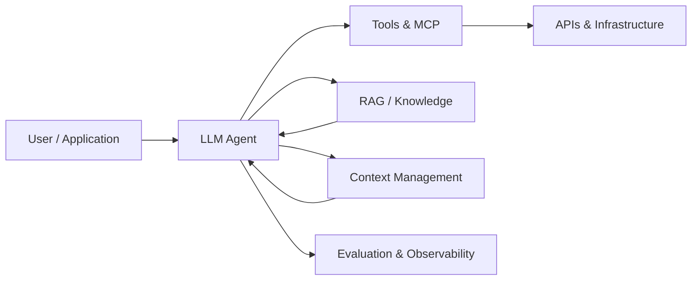

# Omar Morsi

**GenAI Developer @ Ericsson · Computer Science @ Concordia University**

I build AI systems that connect **LLMs, agents, tools, data, and software infrastructure**.

My current focus is production-oriented GenAI: **agentic systems, RAG, MCP, context engineering, model routing, evaluation, and AI reliability**.

[LinkedIn](https://www.linkedin.com/in/omarmorsi/) · [GitHub](https://github.com/omorsi45)

---

## What I Build

I am especially interested in the engineering problems around AI systems:

- **Agents** — tool use, orchestration, model selection, and reliable execution
- **Context** — long-context handling, compression, routing, and context-aware systems
- **Knowledge** — RAG, retrieval, semantic search, and grounding
- **Evaluation** — measuring quality, hallucinations, regressions, and model behavior
- **Reliability** — testing, guardrails, failure handling, and production observability

At Ericsson, I work on **Generative AI engineering** and AI-enabled software workflows.

---

## Selected Work

### [HalluciScope](https://github.com/omorsi45/HalluciScope)
**RAG hallucination detection and verification**

DeBERTa NLI + self-consistency + semantic similarity + ensemble scoring, with a FastAPI/React interface and FAISS/Ollama-based retrieval stack.

### [Surgical Workflow Analysis](https://github.com/omorsi45/surgical-workflow-analysis)
**Multi-task deep learning for surgical video understanding**

Phase recognition and surgical tool detection using PyTorch, ResNet-50, and temporal models. The project includes an audited evaluation pipeline with tests covering data handling, losses, metrics, masking, and model behavior.

### [NOVA](https://github.com/omorsi45/NOVA)
**Network analysis and failure prediction**

Python-based network telemetry analysis combined with GNS3 simulation and machine learning.

### Distributed Task Management API
**Backend / distributed systems**

Java + Spring Boot + PostgreSQL + Docker REST API for distributed task management.

---

## Engineering Focus

| Area | Technologies / Concepts |
|---|---|
| **GenAI** | LLMs · Agents · RAG · MCP · Tool Calling · Context Engineering |
| **AI/ML** | PyTorch · TensorFlow · scikit-learn · Computer Vision · NLI |
| **Backend** | Python · Java · Node.js · FastAPI · Spring Boot · PostgreSQL |
| **Infrastructure** | AWS · Docker · Linux · APIs · CI/CD |
| **Developer Tools** | Git · GitHub · Jupyter · VS Code · GNS3 |

---

## How I Approach AI Engineering

**Build → Measure → Test → Audit → Improve**

I care about more than getting an LLM to produce a good demo. I focus on whether an AI system is **measurable, testable, debuggable, and reliable enough to operate in real software**.

---

## Currently

Building production-oriented GenAI systems at Ericsson while continuing work in machine learning, computer vision, and AI for healthcare.

---

Open to interesting problems in GenAI, AI agents, ML systems, and applied AI.
